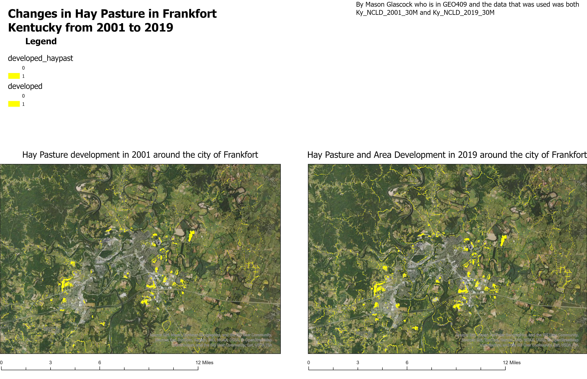

# Frankfort, Kentucky

## Changes in Hay Pasture from 2001 to 2019 

Looking at the maps that I have on here, it looks like that around the city of Frankfort, hay ground has become widespread. They are simple changes, however, ypu can see the changes slowly creepping outside the city. 

  
Changes of Frankfort from 2001 to 2019

["C:\GlascockGIS\Frankfort\frankfort.pdf"](frankfort.pdf)

This project was by Mason Glascock and I had used two different data sources to help me. The two were Ky_NCLD_2001_30M and Ky_NCLD_2019_30M 
